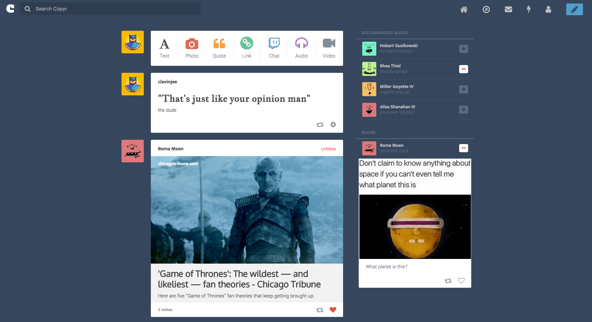
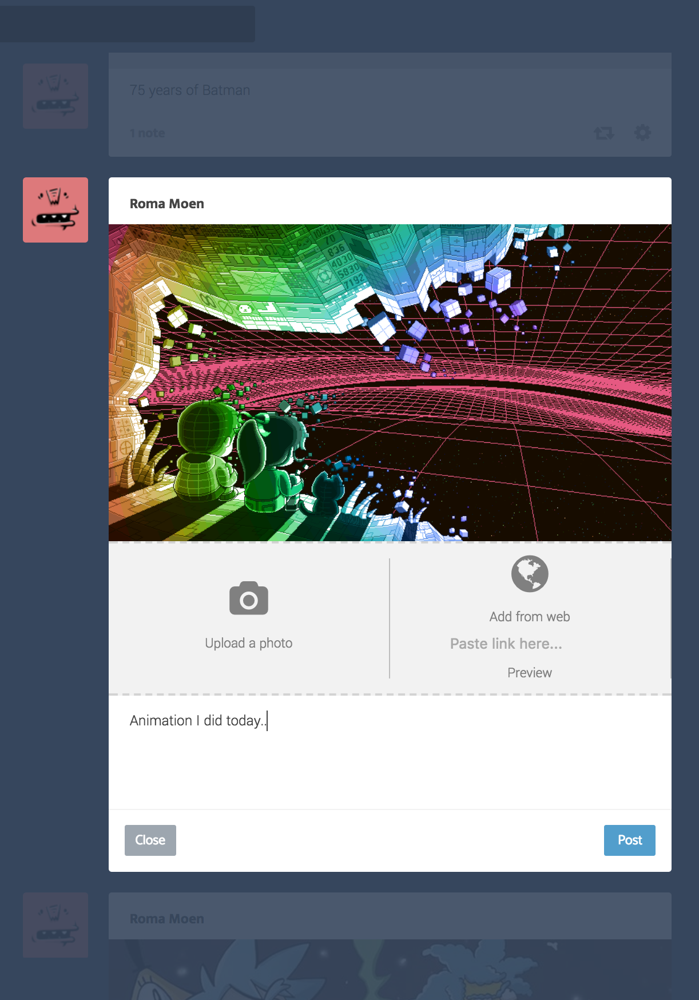

# Copyr
[Live](https://copyr.calvinjee.com)

Inspired by the microblogging and social networking website Tumblr, Copyr is a full stack web application built using Ruby on Rails, a PostgreSQL database, and the React and Redux open-source libraries. Copyr allows users to share all forms of content, including image, audio, and video through seven different types of posts. Posts are primarily viewed on the user's dashboard where he/she can 'like' posts as well as 'follow' other users.

## Features & Implementation

### Posts
There are seven types of posts available to the user, all of which are held in a single table and identified by that post's content type: `text`, `image`, `quote`, `link`, `chat`, `audio`, and `video`.

Some attributes in the table are shared while others remain unique to the type of post. For example `text_body`, is shared across all posts which represents any (rich) text commentary the user would like to add to his/her post. Additionally with the help of the `paperclip` gem, `image`, `audio`, and `video` each hold their own columns for file uploads. `Link`s are scraped for their meta tags including the `<title>` and `<description>` to produce a preview of that URL.

Forms for each type are necessary to take in user input. A form is rendered by its own presentational component but share one `PostFormContainer` as each needs access to the same props from state as well as the same dispatch functions. Once the form is submitted, a post is automatically rendered on the user's dashboard through the `PostDetail` component. This component is responsible for handling what parts of the `posts` table to render based on the type. Additionally, user's can edit their own posts directly on the dashboard.

### Likes
As with many social media websites, users have the ability to 'like' other posts directly on the feed. Liking a post will increase that individual post's 'note' count, which represents the total number of 'likes' and 'reblogs' (to come). If the post belongs to the logged in user, the user will have the ability to edit or delete the post rather than to like it.

### Follows
Following users is also an integral part of any social platform. Users can be followed

## Upcoming Features

### Reblogging
Users will eventually have the ability to reblog other posts. These will count towards the number of 'notes'. The post will show the username it was reblogged from as well as the original user if they are not the same.

### User Page with Search
Clicking on a username will slide a pane in from the right side which will show all the posts from that particular user. The logged is still on the main dashboard at this point.

### Additional pages to explore posts by content
Complementary to the dashboard, there will be other pages where the logged in user can search for all posts where they can also filter by content type.

### Integrate Spotify / SoundCloud API for audio posts
Users will be able to post audio tracks via the Spotify / SoundCloud APIs--more common sources of music.
